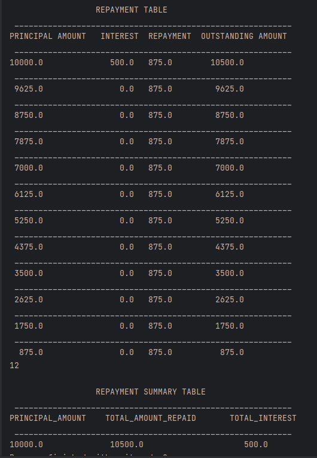

# Getting Started

## About Pezesha Loan Repayment Calculator
This is a java project with a loan calculator function that accepts the following user inputs:
Loan amount,
Loan term (in months),
Interest rate (per year),
Repayment frequency (monthly, bi-monthly, or weekly).

This function will then calculate the total interest to be paid, total amount to be paid and outputs a table of loan repayments over the loan term on console.

This is a sample console input from user:

This is a sample example of expected output for a 10,000 loan taken for a period of 12 months, interest rate of 5% and monthly basis:

## Dependencies
JDK 8+ 

## Setting up the project
Clone the repository with the command `git clone https://github.com/cheruiyotcollins/loan-repayment-calculator.git` for https or `git@github.com:cheruiyotcollins/loan-repayment-calculator.git` for ssh
Navigate to the project directory and :
1. Open the project using your favourite IDE and locate the main class and run.
2. Go to the console and follow the prompts to enter required values for loan repayment calculation.

